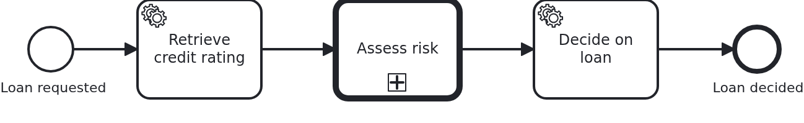
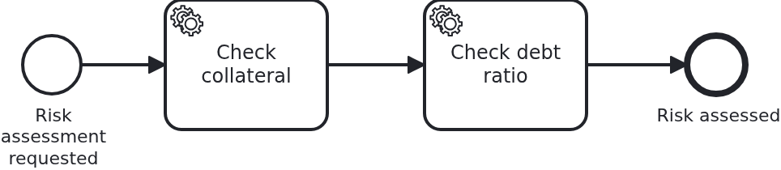

# Call activities to reduce complexity

[](./LICENSE)

A process grows until its diagram no longer fits on a screen. A call activity is the way
out: a section of the model moves into a process of its own, and the calling process points
at it. This blueprint shows what that costs in code, which is nothing, and the one thing the
model has to carry so that both process instances stay one business case.

## What this blueprint shows





The loan approval of the base blueprint, with the risk assessment moved out. The calling
process rates the request, hands over to `risk_assessment` and decides once it comes back.
The called process does the two checks the decision needs.

A call activity is executed by the BPMS, not by your code. There is no `@WorkflowTask`
method for it and no `ProcessService` call: the engine starts an instance of the called
process, waits for it to end and then moves the calling token on. Splitting a model this way
is a change to the BPMN alone.

Both processes work on one workflow aggregate. Whatever a decomposed section does could as
well have been drawn into the calling model, so it is the same business case, and there is
nothing to copy or keep in sync. `checkCollateral` and `checkDebtRatio` write onto the loan
approval, and `decideOnLoan` reads what they wrote as if it had all happened in one diagram.

One annotation wires the tasks of both processes:

```java
@WorkflowService(
    workflowAggregateClass = Aggregate.class,
    bpmnProcess = @BpmnProcess(bpmnProcessId = "loan_approval"),
    secondaryBpmnProcesses = @BpmnProcess(bpmnProcessId = "risk_assessment"))
```

`secondaryBpmnProcesses` names every process besides the one the application starts. Put
called processes there rather than into a handler class of their own: VanillaBP builds one
`ProcessService` per workflow aggregate class, and with a second workflow service class on
the same aggregate the process `startWorkflow` starts is whichever class the classpath scan
found first. That can be the called process, and nothing says so - the workflow runs, the
wrong half of the model runs, and the aggregate ends up half filled.

The call activity carries no input mapping, and that is worth a sentence because it used to
need one. VanillaBP finds the workflow aggregate of a task by the handle the engine keeps on
the process instance, and a called instance is a new one which does not get that handle by
itself. Which handle it is depends on the engine, so tying the two instances together is the
adapter's business rather than the model's: on Camunda 7 the business key carries the
aggregate's ID and VanillaBP passes it on while deploying, on Camunda 8 the ID travels as a
process variable and `propagateAllParentVariables` is the engine's default.

The model therefore says nothing about identity on either engine, which is the state a
blueprint should show: what differs between the two engines is what the adapter does, not
what you have to write.

Decomposition is one of the two reasons to split a model, and the only one a call activity
is for. A process used by several different parent processes would need a workflow aggregate
of its own, and VanillaBP answers that case differently: model the other process as a
collapsed pool and start it from a service task, so the two stay separate business cases with
separate data. The
[SPI documentation](https://github.com/vanillabp/spi-for-java#call-activities) puts both
situations side by side.

## Delta to the base blueprint

Compared to [`module-single`](https://github.com/vanillabp-blueprints/module-single-springboot):

|            File            |                                                 What is different                                                  |
|----------------------------|--------------------------------------------------------------------------------------------------------------------|
| `loan_approval.bpmn`       | a call activity pointing at `risk_assessment`, and a task after it using the result                                |
| `risk_assessment.bpmn`     | new: the called process, two service tasks between a plain start and end event                                     |
| `WorkflowTaskHandler.java` | `secondaryBpmnProcesses` names the called process; its tasks are methods like any other                            |
| `Aggregate.java`           | what the called process writes, and the decision made from it                                                      |
| `Service.java`             | the two checks of the risk assessment and the decision after it                                                    |
| `loan-approval.yaml`       | the two numbers the checks and the decision use                                                                    |
| `LoanApprovalIT.java`      | asserts across the call activity: the calling process is started, the result of the called one is on the aggregate |

Both BPMN files sit in the same directory of the workflow module and are deployed together.
A called process is part of the module which owns it, not a module of its own.

## Running it

Requires a JDK 21. Camunda 7 is embedded, so nothing else has to run:

```bash
mvn install verify
```

Running it on another BPMS is a Maven profile, not one line of Java changes:

```bash
mvn install verify -Pcamunda8
```

Camunda 8 is a remote engine, so a cluster has to run and be pointed at. Start one, then
add its address to `application/src/main/resources/application.yaml` and to
`loan-approval/src/test/resources/application.yaml`:

```yaml
vanillabp:
  adapters:
    camunda8:
      rest-address: http://localhost:8080
      # Nothing else is needed: this adapter keeps workflow modules apart by nothing at all
      # ('name-clash-avoidance: none') unless told otherwise, because a cluster started from
      # the stock image has multi-tenancy switched off and rejects a tenant per module. The
      # adapter warns about it while booting - with one workflow module the identifiers are
      # unique anyway. Set 'name-clash-avoidance: use-prefix' to have VanillaBP prefix them.
```

Start the application:

```bash
mvn -pl application spring-boot:run
```

Booting logs a warning per workflow module: both Camunda adapters start out with
`name-clash-avoidance: none`, so nothing keeps the identifiers of one workflow module apart
from those of another, and the adapter asks for a decision instead of picking one. One module
cannot collide with itself, so this blueprint leaves it at that. Answering the question is one
property, `vanillabp.adapters.<id>.accept-unscoped-identifiers: true`, and the modes a BPMS
offers are in
[the wiki](https://github.com/vanillabp/adapter-platform-integration/wiki/Workflow-modules#how-name-clashes-are-avoided).

This is the URL that starts a loan approval:

```
http://localhost:8080/api/loan-approval/start?amount=5000
```

The log shows the calling and the called process working on one loan approval, with nothing
marking the border between them:

```
Loan approval '4d0e…' started
Credit rating of loan approval '4d0e…' is 50
Collateral of loan approval '4d0e…' is worth 3000
Debt ratio of loan approval '4d0e…' is 10%
Loan approval '4d0e…' was approved (rating 50, debt ratio 10%, collateral 3000)
```

An amount of 30000 rates just as well but takes the debt ratio past the configured maximum,
which is the decision the calling process makes from what the called one found:

```
Loan approval '92a5…' was rejected (rating 100, debt ratio 60%, collateral 18000)
```

The result of a run is at

```
http://localhost:8080/api/loan-approval/{loanRequestId}
```

Both numbers the checks use are in the module's own configuration
(`loan-approval/src/main/resources/loan-approval/loan-approval.yaml`).

While the application runs on Camunda 7, Camunda's own web applications are served at

```
http://localhost:8080/camunda
```

Log in with `demo` / `demo`. Cockpit is the place a call activity is worth looking at: the
calling instance stands in the call activity while a second instance runs the called
process, and the two are linked in both directions. The user comes from
`application/src/main/camunda7/resources/camunda7-webapps.yaml` and exists so that the
blueprint can be operated without setting one up; an application with an identity provider
of its own leaves that section out.

The Camunda 8 profile ships neither the dependency nor that file. Its tooling is part of
the cluster, and the file names a Camunda 7 adapter id, which VanillaBP would rightly
refuse to start with.

## How it works

|                                             File                                             |                                      Role                                       |
|----------------------------------------------------------------------------------------------|---------------------------------------------------------------------------------|
| `loan-approval/src/main/resources/loan-approval/processes/<adapter-id>/loan_approval.bpmn`   | the calling process: the call activity and the task using its result            |
| `loan-approval/src/main/resources/loan-approval/processes/<adapter-id>/risk_assessment.bpmn` | the called process, started by nobody but the call activity                     |
| `.../loanapproval/WorkflowTaskHandler.java`                                                  | the tasks of both processes, wired by one `@WorkflowService`                    |
| `.../loanapproval/Service.java`                                                              | the business code, which does not know that two processes are involved          |
| `.../loanapproval/model/Aggregate.java`                                                      | the one aggregate, with a comment per attribute saying which process writes it  |
| `loan-approval/src/test/.../LoanApprovalIT.java`                                             | starts the calling process and waits for the decision, across the call activity |

The order of events: `retrieveCreditRating` runs in the calling process, the engine starts
`risk_assessment` and passes the aggregate's ID along, the two checks of the called process
run as ordinary workflow tasks, the called process ends, the call activity completes and
`decideOnLoan` reads the result. Every one of those tasks is a transaction of its own, and
the aggregate is loaded and saved around each of them.

Nothing in the business code says which process it serves. That is the property worth
keeping: a section moved into a called process today can move back into the calling model
tomorrow, and only the BPMN files change.

## Documentation

- [Call activities](https://github.com/vanillabp/spi-for-java#call-activities): decomposition and reuse, and why they are modelled differently
- [Wire up a process](https://github.com/vanillabp/spi-for-java#wire-up-a-process): `@WorkflowService`, `@BpmnProcess` and what `secondaryBpmnProcesses` is for
- [Workflow aggregates](https://github.com/vanillabp/adapter-platform-integration/wiki/Workflow-aggregates): one aggregate per business case, and why there are no process variables
- [Digging into call activities](https://github.com/vanillabp/adapter-platform-integration/wiki/Viewing-workflows#digging-into-call-activities): following a workflow across a call activity
- the wiki of the [BPMS adapter](https://github.com/vanillabp/adapter-platform-integration/wiki/BPMS-adapters) you use: how that engine identifies a called process instance

This blueprint is developed in the monorepo
[`blueprints`](https://github.com/vanillabp-blueprints/blueprints). This repository is a
read-only mirror, **issues and pull requests belong there.**

## Noteworthy & Contributors

[VanillaBP](https://www.github.com/vanillabp/spi-for-java) was developed by [Phactum](https://www.phactum.at) with the
intention of giving back to the community as it has benefited the community in the past.


## License

Copyright 2026 Phactum Softwareentwicklung GmbH

Licensed under the Apache License, Version 2.0
